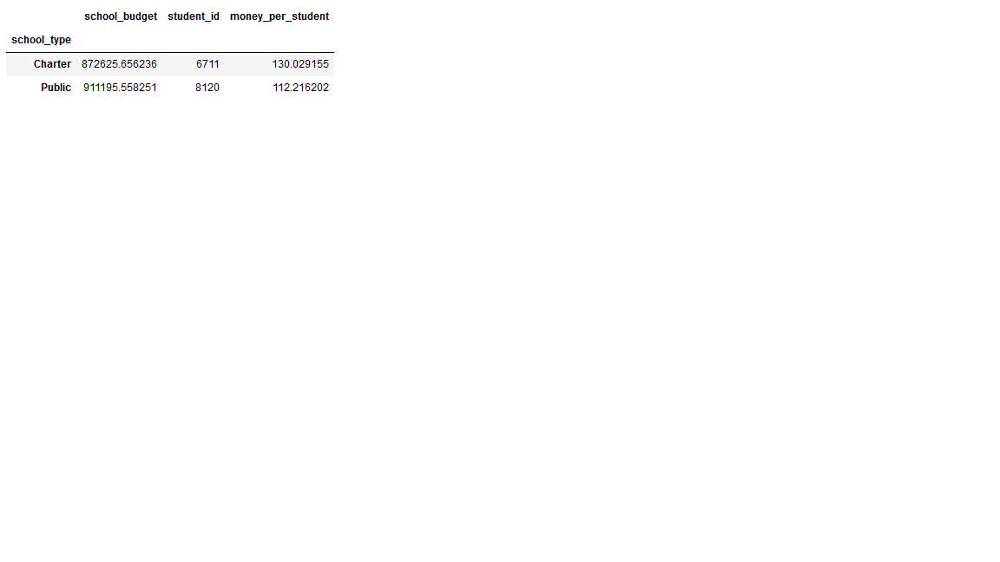
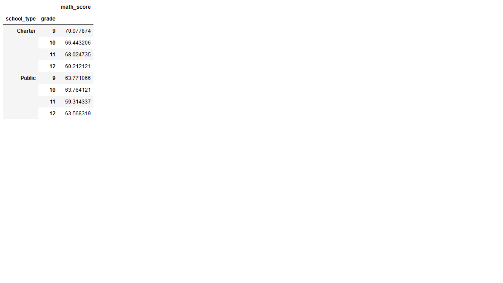
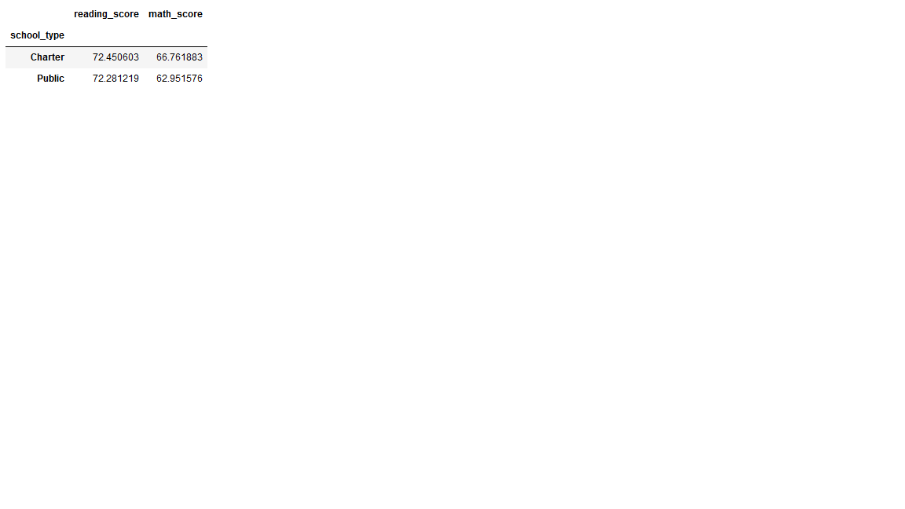

# School_District_Analysis
## Overview
With the school district data provided, I utitlized pandas functionality to analyze and visualize said data based upon the year of school, math score, reading score, school type, and the schools budget.

## Summary
What surpised me is that the "average score" is close to what you'd consider average, a C. Reading scores are much lower than I expected with the lowest score being 10.5. The reading scores and math scores between charter schools are within' 8% of each other, rather close. In charter schools their math scores peak in their junior year and in public schools their reach their lowest point on average. Public schools have better funding than charter schools overall. Even though the budget is lower in charter schools over all the amount spent per student is higher in charter schools by less than $18 per student per year.
